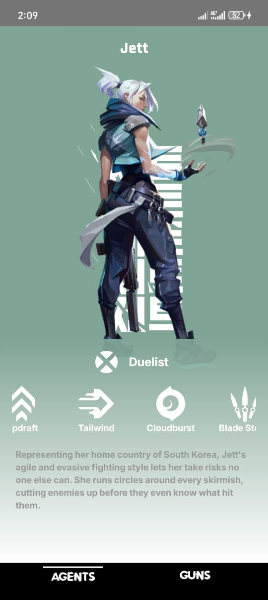
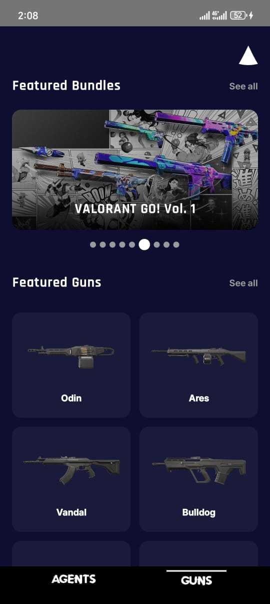
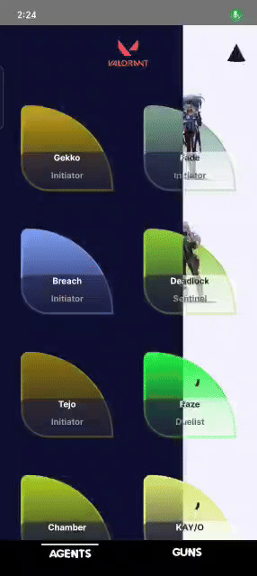

# 🎮 Valorant UI - Kotlin Multiplatform

<div align="center">


**A Beautiful Kotlin Multiplatform Mobile App showcasing Valorant Agents, Weapons, and Game Data**

[](https://kotlinlang.org)
[](https://www.jetbrains.com/lp/compose-multiplatform/)
[](https://developer.android.com)
[](https://www.apple.com/ios)
[](https://www.w3.org/WAI/WCAG21/quickref/)
[](LICENSE)

[Features](#-features) • [Screenshots](#-screenshots) • [Tech Stack](#-tech-stack) • [Architecture](#-architecture) • [Accessibility](#-accessibility) • [Getting Started](#-getting-started) • [Testing](#-testing)

</div>

---

## 📱 About

Valorant UI is a **Kotlin Multiplatform** mobile application that brings the world of Valorant to your fingertips! Browse through all Valorant agents, explore their abilities, check out weapon stats, and dive deep into the tactical shooter universe - all with a sleek, modern UI built using **Compose Multiplatform**.

### ✨ Features

- 🎯 **Agent Gallery** - Browse all Valorant agents with beautiful card layouts
- 🔍 **Agent Details** - Detailed information about each agent including abilities, role, and background
- 🔫 **Weapons Showcase** - Complete weapon database with stats and skins
- 🎨 **Theme Switching** - Smooth light/dark mode with wipe animation transition
- 💾 **Offline Support** - Local caching with SQLDelight for offline access
- 🚀 **Smooth Animations** - Shared element transitions and fluid animations
- 🌐 **Real API Integration** - Fetches live data from Valorant API
- 📊 **MVI Architecture** - Clean, scalable, and testable codebase with unidirectional data flow
- ♿ **Fully Accessible** - WCAG 2.1 AA & EAA compliant with TalkBack support

---

## 📸 Screenshots

### Android

<div align="center">
  
| Agents List | Weapons | Weapons Details | Theme Switch |
|:-:|:-:|:-:|:-:|
|  |  |  |  |

</div>

### 🍎 iOS Version

<div align="center">

**Coming Soon!** 🚀

iOS version is under development and will be available in the next release.

</div>

---

## 🛠️ Tech Stack

### 🎨 UI Framework
- **[Compose Multiplatform](https://www.jetbrains.com/lp/compose-multiplatform/)** - Declarative UI framework
- **[Material Design 3](https://m3.material.io/)** - Modern material design components
- **[Jetpack Compose Navigation](https://www.jetbrains.com/help/kotlin-multiplatform-dev/compose-navigation-routing.html)** - Type-safe multiplatform navigation
- **[Coil 3](https://coil-kt.github.io/coil/)** - Image loading with Ktor & OkHttp support
- **[Lottie](https://airbnb.io/lottie/)** - Beautiful animations
- **[SDP Compose](https://github.com/Kaaveh/sdp-compose)** - Scalable size units

### 🏗️ Architecture & Patterns
- **MVI (Model-View-Intent)** - Unidirectional data flow with intent-based actions
- **Clean Architecture** - Separation of concerns across layers
- **Repository Pattern** - Data abstraction layer
- **UseCase Pattern** - Business logic isolation
- **State Hoisting** - Proper state management in Compose

### 🔌 Dependency Injection
- **[Koin 4.1.1](https://insert-koin.io/)** - Lightweight DI framework
  - `koin-core` - Core DI
  - `koin-android` - Android integration
  - `koin-compose` - Compose integration

### 🌐 Networking
- **[Ktor 3.3.1](https://ktor.io/)** - Multiplatform HTTP client
  - `ktor-client-core` - Core client
  - `ktor-client-okhttp` - OkHttp engine for Android
  - `ktor-client-java` - Java engine for Desktop
  - `ktor-serialization-kotlinx-json` - JSON serialization
  - `ktor-client-content-negotiation` - Content negotiation
  - `ktor-client-logging` - Network logging

### 💾 Local Storage
- **[SQLDelight 2.1.0](https://cashapp.github.io/sqldelight/)** - Type-safe SQL database
  - `sqldelight-android-driver` - Android driver
  - `sqldelight-coroutines-extensions` - Coroutines support
- **[DataStore 1.1.7](https://developer.android.com/topic/libraries/architecture/datastore)** - Preferences storage
  - `datastore-preferences` - Key-value storage
  - `datastore-core-okio` - Multiplatform support

### 🧵 Concurrency
- **[Kotlinx Coroutines 1.10.2](https://kotlinlang.org/docs/coroutines-overview.html)** - Asynchronous programming
  - Flow-based reactive streams
  - Structured concurrency
  - Multiplatform support

### 🧪 Testing
- **[Kotlin Test](https://kotlinlang.org/api/latest/kotlin.test/)** - Multiplatform testing framework
- **[Kotlinx Coroutines Test 1.10.2](https://kotlinlang.org/api/kotlinx.coroutines/kotlinx-coroutines-test/)** - Coroutines testing utilities
- **[Turbine 1.2.1](https://github.com/cashapp/turbine)** - Flow testing library
- **[Compose UI Test](https://developer.android.com/jetpack/compose/testing)** - Compose UI testing
- **[JUnit 4](https://junit.org/junit4/)** - Testing framework
- **[Espresso](https://developer.android.com/training/testing/espresso)** - Android UI testing
- **54 Tests** - Unit, UI, and Integration tests

### 📦 Serialization
- **[Kotlinx Serialization 1.9.0](https://kotlinlang.org/docs/serialization.html)** - JSON serialization/deserialization

### 📐 Build Tools
- **[Gradle 8.13.0](https://gradle.org/)** - Build system
- **[Kotlin 2.2.21](https://kotlinlang.org/)** - Programming language
- **[Android Gradle Plugin 8.13.0](https://developer.android.com/build)** - Android build tools
- **[KSP 2.3.0](https://kotlinlang.org/docs/ksp-overview.html)** - Kotlin Symbol Processing

### 🎯 Target Platforms
- **Android** - Min SDK 24, Target SDK 36 ✅
- **iOS** - Coming Soon 🚀
- **Desktop** - JVM support ✅

### 🔧 Development Tools
- **[Napier 2.6.1](https://github.com/AAkira/Napier)** - Multiplatform logging
- **[Multiplatform Settings 1.3.0](https://github.com/russhwolf/multiplatform-settings)** - Settings management

---

## 🏛️ Architecture

```
┌─────────────────────────────────────────────────────────┐
│                    Presentation Layer                    │
│  ┌─────────────┐  ┌──────────────┐  ┌───────────────┐  │
│  │   Compose   │  │  ViewModels  │  │   UI States   │  │
│  │     UI      │◄─┤    (MVI)     │◄─┤   & Intents   │  │
│  └─────────────┘  └──────────────┘  └───────────────┘  │
└────────────────────────┬────────────────────────────────┘
                         │
┌────────────────────────▼────────────────────────────────┐
│                     Domain Layer                         │
│  ┌─────────────┐  ┌──────────────┐  ┌───────────────┐  │
│  │  Use Cases  │  │    Models    │  │  Repositories │  │
│  │  (Business  │  │   (Entities) │  │  (Interfaces) │  │
│  │    Logic)   │  └──────────────┘  └───────────────┘  │
│  └─────────────┘                                         │
└────────────────────────┬────────────────────────────────┘
                         │
┌────────────────────────▼────────────────────────────────┐
│                      Data Layer                          │
│  ┌─────────────┐  ┌──────────────┐  ┌───────────────┐  │
│  │  Repository │  │  Remote API  │  │  Local Cache  │  │
│  │     Impl    │─►│    (Ktor)    │  │  (SQLDelight) │  │
│  └─────────────┘  └──────────────┘  └───────────────┘  │
└─────────────────────────────────────────────────────────┘
```

### Project Structure

```
composeApp/
├── src/
│   ├── commonMain/kotlin/
│   │   ├── data/
│   │   │   ├── remote/          # API service & DTOs
│   │   │   ├── local/           # SQLDelight database
│   │   │   └── repository/      # Repository implementations
│   │   ├── domain/
│   │   │   ├── model/           # Business models
│   │   │   ├── repository/      # Repository interfaces
│   │   │   └── usecase/         # Business logic use cases
│   │   ├── presentation/
│   │   │   ├── viewmodel/       # ViewModels (MVI)
│   │   │   └── uistates/        # UI States & Intents
│   │   ├── ui/
│   │   │   ├── view/            # Compose screens
│   │   │   ├── components/      # Reusable components
│   │   │   ├── theme/           # Theme & styling
│   │   │   └── navigation/      # Navigation setup
│   │   └── di/                  # Koin modules
│   │
│   ├── androidMain/kotlin/      # Android-specific code
│   ├── desktopMain/kotlin/      # Desktop-specific code
│   ├── iosMain/kotlin/          # iOS-specific code (Coming soon)
│   │
│   ├── commonTest/kotlin/       # Unit tests
│   │   ├── viewmodel/           # ViewModel tests
│   │   └── repository/          # Repository tests
│   │
│   └── androidInstrumentedTest/ # UI & Integration tests
│       ├── ui/                  # Compose UI tests
│       └── integration/         # E2E tests
│
└── build.gradle.kts
```

---

## 🚀 Getting Started

### Prerequisites

- **Android Studio** Hedgehog (2023.1.1) or newer
- **JDK 17** or higher
- **Android SDK** with API level 36
- **Kotlin** 2.2.21

### Installation

1. **Clone the repository**
```bash
git clone https://github.com/OmarLkhalil/valorantui.git
cd valorantui
```

2. **Open in Android Studio**
   - Open Android Studio
   - Select "Open an Existing Project"
   - Navigate to the cloned directory

3. **Sync Gradle**
```bash
./gradlew sync
```

4. **Run the app**
   - Select your target device/emulator
   - Click the "Run" button or press `Shift + F10`

### Build Variants

```bash
# Build Android APK
./gradlew :app:assembleDebug

# Build Desktop App
./gradlew :composeApp:run

# iOS (Coming Soon)
./gradlew :composeApp:iosApp
```

---

## 🧪 Testing

The project includes comprehensive test coverage across all layers:

### Run Tests

```bash
# Run all unit tests
./gradlew test

# Run Android unit tests
./gradlew :composeApp:testDebugUnitTest

# Run Android UI tests (requires emulator/device)
./gradlew :composeApp:connectedAndroidTest

# Run specific test class
./gradlew :composeApp:testDebugUnitTest --tests "*AgentsViewModelTest"
```

### Test Coverage

- **27 Unit Tests** - ViewModels & Repositories
- **21 UI Tests** - Compose UI components
- **6 Integration Tests** - End-to-end user flows
- **Total: 54 Tests** ✅

### Test Structure

```
commonTest/
├── presentation/viewmodel/
│   ├── AgentsViewModelTest.kt          (9 tests)
│   └── AgentDetailsViewModelTest.kt     (9 tests)
└── domain/repository/
    └── AgentsRepositoryTest.kt         (9 tests)

androidInstrumentedTest/
├── ui/view/
│   ├── AgentsScreenComposeTest.kt       (9 tests)
│   └── AgentDetailsScreenComposeTest.kt (12 tests)
└── integration/
    └── AgentsIntegrationTest.kt         (6 tests)
```

---

## ♿ Accessibility

This app is built with accessibility in mind and follows **WCAG 2.1 Level AA** and **EAA (European Accessibility Act)** guidelines to ensure everyone can use it.

### ✅ Compliance Standards

- ✅ **WCAG 2.1 Level AA** - Web Content Accessibility Guidelines
- ✅ **EAA Compliant** - European Accessibility Act requirements
- ✅ **TalkBack Ready** - Full screen reader support for Android
- ✅ **Android Accessibility Scanner** - Tested and verified

### 🎯 Accessibility Features

#### 1. Screen Reader Support (TalkBack)
```kotlin
// Every interactive element has proper labels
.semantics {
    contentDescription = "Weapon upgrade levels section, 3 levels available"
}
```
- ✅ Clear and descriptive labels for all UI elements
- ✅ Proper heading structure with `heading()` semantics
- ✅ Logical navigation order
- ✅ Meaningful content descriptions

#### 2. Touch Target Sizes
- ✅ **Minimum 48dp** touch targets for all interactive elements
- ✅ Adequate spacing between clickable items
- ✅ Easy to tap buttons and cards

#### 3. Dynamic Font Scaling
```kotlin
// All text uses Theme typography
Text(
    text = "Weapon Name",
    style = Theme.typography.body16  // Scales with system settings
)
```
- ✅ Supports system font size settings (100% - 300%)
- ✅ No hardcoded font sizes
- ✅ Maintains layout integrity at all scales

#### 4. Color Contrast
- ✅ **Minimum 4.5:1** contrast ratio for normal text
- ✅ **Minimum 3:1** contrast ratio for large text
- ✅ Works in both Light and Dark themes
- ✅ Theme-based colors ensure consistent contrast

#### 5. Non-Color Dependent Content
```kotlin
// Icons + Text labels
Row {
    Text(text = "🎯")  // Icon
    Text(text = "Category")  // Label
    Text(text = "Heavy Weapons")  // Value
}
```
- ✅ Information not conveyed by color alone
- ✅ Icons accompany text labels
- ✅ Clear visual hierarchies

#### 6. Alternative Input Methods
```kotlin
// Custom actions for gesture alternatives
customActions = listOf(
    CustomAccessibilityAction("Pause auto-rotation") { ... },
    CustomAccessibilityAction("Rotate left") { ... },
    CustomAccessibilityAction("Rotate right") { ... }
)
```
- ✅ All gestures have accessibility alternatives
- ✅ Custom accessibility actions for complex interactions
- ✅ Keyboard navigation support

#### 7. Content Structure
- ✅ Proper semantic headings
- ✅ Logical content order
- ✅ Screen reader-friendly navigation
- ✅ `mergeDescendants` for complex components

### 🧪 Accessibility Testing

The app has been tested with:

1. **TalkBack** (Android Screen Reader)
   ```bash
   # Enable TalkBack
   Settings → Accessibility → TalkBack → On
   ```

2. **Android Accessibility Scanner**
   - Install from Play Store
   - Scan all screens
   - Fix issues identified

3. **Manual Testing**
   - Font scaling: 100%, 200%, 300%
   - Color contrast verification
   - Touch target testing
   - Screen reader navigation

### 📋 WCAG 2.1 Checklist

| Criterion | Level | Status |
|-----------|-------|--------|
| 1.1.1 Non-text Content | A | ✅ |
| 1.3.1 Info and Relationships | A | ✅ |
| 1.4.3 Contrast (Minimum) | AA | ✅ |
| 1.4.4 Resize Text | AA | ✅ |
| 1.4.11 Non-text Contrast | AA | ✅ |
| 2.1.1 Keyboard | A | ✅ |
| 2.4.6 Headings and Labels | AA | ✅ |
| 2.5.5 Target Size | AAA | ✅ |
| 3.2.4 Consistent Identification | AA | ✅ |
| 4.1.2 Name, Role, Value | A | ✅ |

### 🌍 Why Accessibility Matters

Making apps accessible ensures that **everyone**, regardless of ability, can:
- Browse and enjoy Valorant content
- Navigate independently with screen readers
- Customize text sizes for comfortable reading
- Use the app with assistive technologies

**Accessibility is not optional—it's a fundamental right.** ✊

---

## 📱 Features in Detail

### 🎯 Agents Screen
- Grid layout with agent cards
- Beautiful portraits with role indicators
- Smooth shared element transitions
- Pull-to-refresh support
- Offline caching

### 🔍 Agent Details
- Full agent information
- Abilities showcase with icons
- Animated ability descriptions
- Role and background information
- Swipe gestures for navigation

### 🔫 Weapons Screen
- Complete weapon database
- Weapon stats and damage ranges
- Skin collections
- Interactive 3D preview (Coming soon)
- Filter by category

### 🎨 Theme System
- Light & Dark mode support
- Smooth wipe transition animation
- Persistent theme preference
- System theme follow option
- Custom color schemes

---

## 🗺️ Roadmap

### v1.0.0 - Current ✅
- [x] Agents listing and details
- [x] Weapons showcase
- [x] Theme switching
- [x] Offline support
- [x] Comprehensive testing
- [x] **Full WCAG 2.1 AA Accessibility compliance**
- [x] **TalkBack and screen reader support**

### v1.1.0 - Coming Soon 🚀
- [ ] **iOS Support** - Full iOS implementation
- [ ] Maps information
- [ ] Competitive ranks system
- [ ] Weapon comparison tool
- [ ] Search and filter
- [ ] Favorites system

### v2.0.0 - Future
- [ ] User authentication
- [ ] Match statistics
- [ ] Live game updates
- [ ] Community features
- [ ] Desktop app release

---

## 🤝 Contributing

Contributions are welcome! Here's how you can help:

1. Fork the project
2. Create your feature branch (`git checkout -b feature/AmazingFeature`)
3. Commit your changes (`git commit -m 'Add some AmazingFeature'`)
4. Push to the branch (`git push origin feature/AmazingFeature`)
5. Open a Pull Request

### Development Guidelines

- Follow Kotlin coding conventions
- Write tests for new features
- Update documentation
- Use meaningful commit messages
- Keep PRs focused and small

---

## 📄 License

This project is licensed under the MIT License - see the [LICENSE](LICENSE) file for details.

---

## 🙏 Acknowledgments

- **[Valorant API](https://valorant-api.com/)** - For providing the awesome API
- **[Riot Games](https://www.riotgames.com/)** - For creating Valorant
- **[Compose Multiplatform](https://www.jetbrains.com/lp/compose-multiplatform/)** - For the amazing UI framework
- **JetBrains** - For Kotlin and IntelliJ IDEA

---

## 📞 Contact

**Developer** - [@OmarLkhalil](https://github.com/OmarLkhalil)

**Email** - omarkkhalil12@gmail.com

**Project Link** - [https://github.com/OmarLkhalil/valorantui](https://github.com/OmarLkhalil/valorantui)

---

<div align="center">

### ⭐ Star this repo if you like it!

**Made with ❤️ using Kotlin Multiplatform & Compose**


</div>

